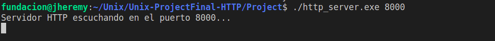
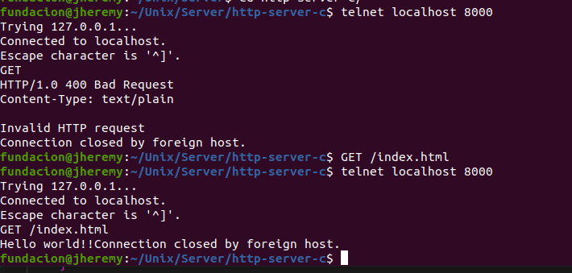
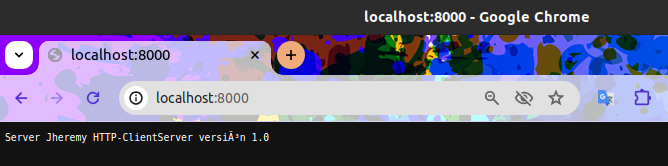
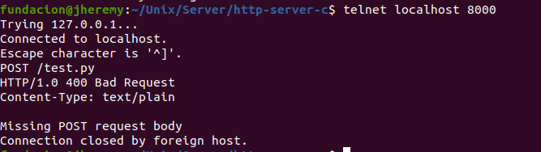

# Client-server application HTTP

### By Jheremy Kevin Tancara Zambrana

---

Este servidor está diseñado para permitirte ejecutar el método GET, POST y acceder al contenido de cualquier archivo. Todo lo que necesitas hacer es seguir estos pasos:

#### Program execution:
    ./http_server 3030

Para correr el programa, simplemente utiliza "./http_server" seguido del "puerto del servidor" que desees especificar para abrirlo.

Posteriormente abres la terminal y corres el siguiente comando:

    telnet localhost "puerto de conexión"

Donde debe especificar a que puerto se conectara: 

    telnet localhost 3030

# GET

Finalmente solo escribir GET / o GET/index.html , para leer el contenido del archivo.

# POST

Para activar un POST y ejecutar un archivo .py, debes escribir lo siguiente como ejemplo: POST /test.py HTTP/1.0 Content-Length: 20 Content-Type: text/plain

    print("Hello, World!")

